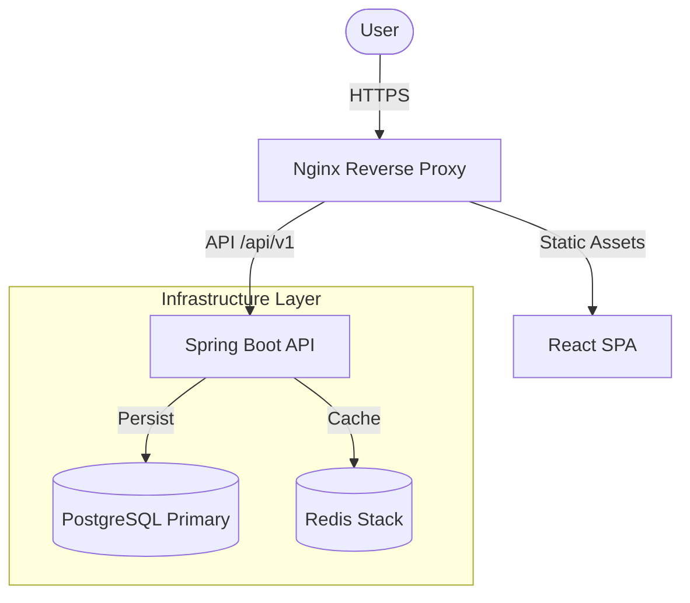

# Enterprise Task Platform

A production-ready, full-stack task management system architected for scalability, reliability, and developer experience.


## 🏗️ System Architecture



## 🚀 Key Engineering Decisions

- **Strict Clean Architecture**: Business logic is decoupled from frameworks, ensuring testability and future-proofing.
- **Optimistic Locking**: Implemented JPA versioning (`@Version`) to handle concurrent updates without "last-write-wins" data loss.
- **Performance Caching**: Redis look-aside caching strategy for high-read endpoints (e.g., Project Dashboards).
- **Security First**: JWT-based stateless authentication with strict Role-Based Access Control (RBAC) and BCrypt hashing.
- **Container Orchestration**: Fully Dockerized environment with multi-stage builds for optimized production artifacts (~150MB images).

## 🛠️ Tech Stack

### Frontend
- **React 18**: Functional components with custom hooks.
- **TypeScript**: Strict type safety.
- **TailwindCSS**: Utility-first styling with custom Design System.
- **Framer Motion**: Smooth, hardware-accelerated animations.
- **Vite**: Next-generation frontend tooling.

### Backend
- **Java 17 (LTS)**: Core language.
- **Spring Boot 3**: Application framework.
- **Spring Data JPA (Hibernate)**: ORM & Persistence.
- **PostgreSQL 15**: Relational Database.
- **Redis 7**: In-memory data structure store.

## 🏁 Getting Started

The entire platform is defined as code. You can spin up the full stack (Frontend, Backend, DB, Cache) with a single command.

### Prerequisites
- Docker & Docker Compose

### 1-Click Deployment
```bash
git clone https://github.com/yourusername/enterprise-platform.git
cd enterprise-platform
docker-compose up -d --build
```

Access the application:
- **Frontend**: [http://localhost:3000](http://localhost:3000)
- **API Docs**: [http://localhost:8081/swagger-ui.html](http://localhost:8081/swagger-ui.html)
- **Health Check**: [http://localhost:8081/actuator/health](http://localhost:8081/actuator/health)

## 🧪 Testing Strategy
- **Unit Tests**: JUnit 5 & Mockito for Service layer isolation.
- **Integration Tests**: TestContainers for real DB integration testing.
- **E2E**: Manual verification of critical user journeys.

## License
MIT
